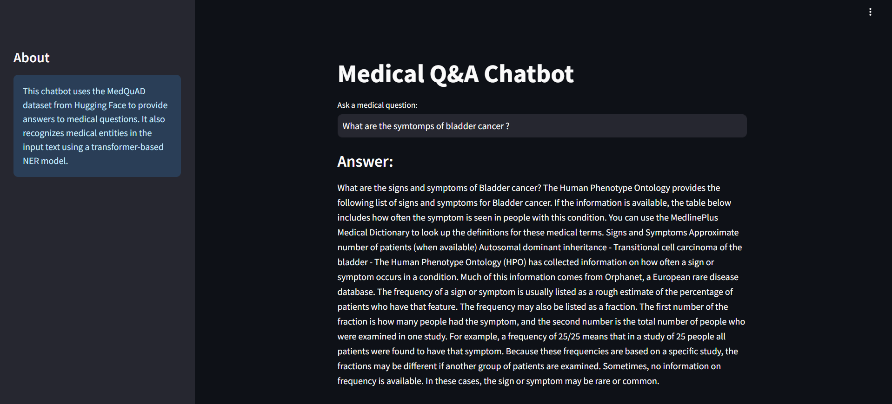
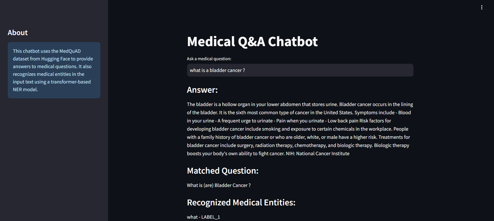
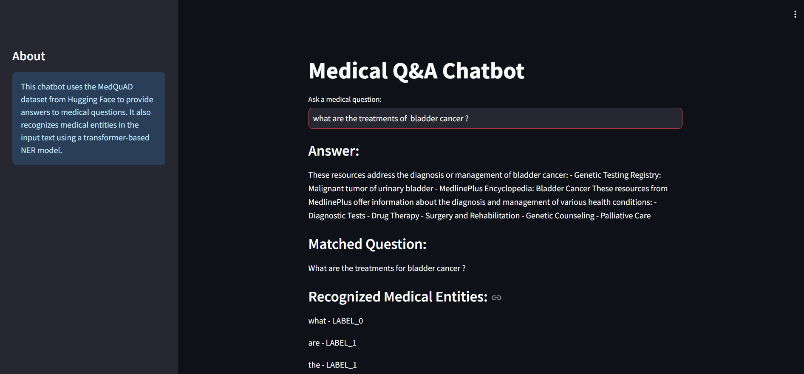

### Develop a Medical Q&A Chatbot using the MedQuAD Dataset Create a specialized medical question-answering chatbot using the MedQuAD dataset. Implementation of a retrieval mechanism to find relevant answers. Basic medical entity recognition (e.g., symptoms, diseases, treatments). Simple user interface using Streamlit for asking medical questions

### Screenshots of the model output:

